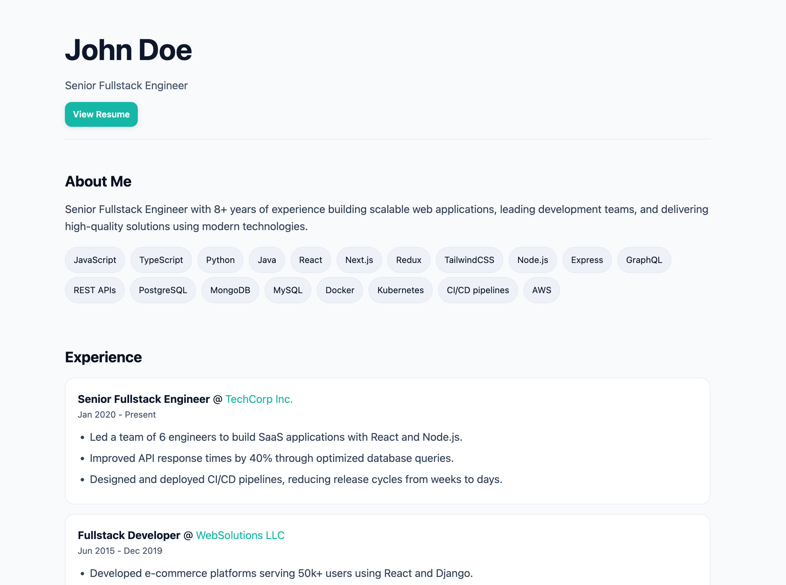
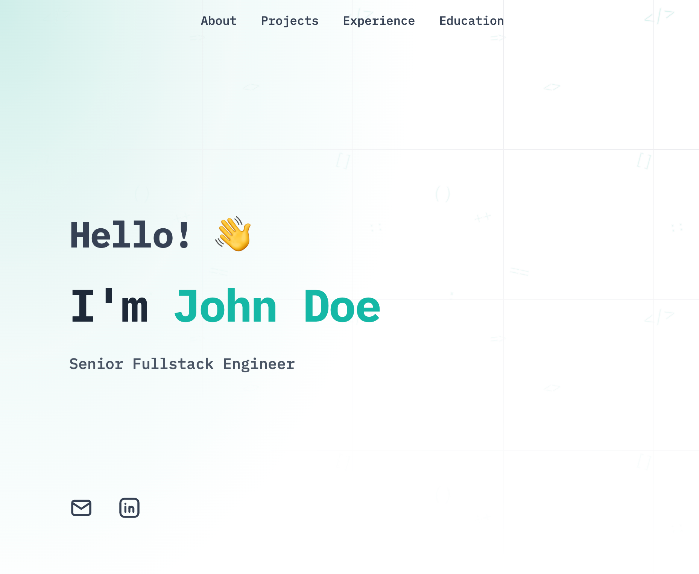
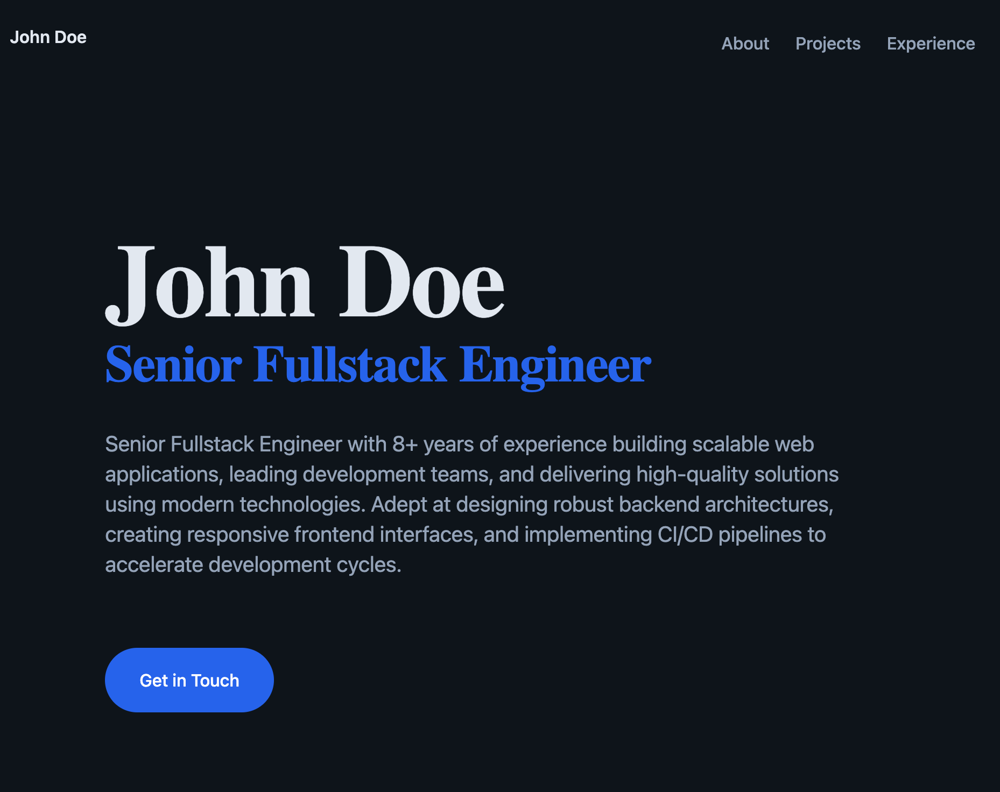

# Foliomade Open Templates

A growing collection of open‑source portfolio templates used by Foliomade. Templates are built to a shared interface so they can be swapped easily and rendered from live portfolio data.

We’d love your help! Contribute new templates, improve existing ones, or report bugs and ideas.

- Issues: open a ticket describing the problem or proposal
- Pull Requests: follow the checklist below and link any related issue


**Why Templates?**
- Consistent data model across designs using a shared `TemplateInput` → `PortfolioSiteConfig` mapper.
- Framework and tooling are preconfigured so you can focus on design and UX.
- Public preview images make browsing templates simple for users.


## Contribute or Report Bugs

- Create an issue with:
  - What happened and what you expected
  - Steps to reproduce (if a bug)
  - Screenshots or preview links when helpful
- Open a pull request when you’re ready. Keep changes focused on a single template or the shared tooling.
- Be kind and keep discussions constructive — thank you!


## Existing Templates (Gallery)

- Classic
  
  

- DevPortfolio
  
  

- Zen
  
  

- Modern (work in progress)


## Tech Stack

- `Astro` with Node adapter (middleware output)
- `Tailwind CSS v4` via Vite plugin
- Shared config and types in `_shared/`
  - `_shared/types.ts` → `TemplateInput` schema
  - `_shared/config.ts` → maps `TemplateInput` to `PortfolioSiteConfig`, fetches data, and injects optional widgets
  - `_shared/astro.base.mjs` → base Astro config reused by every template


## Template Requirements

Every template must include the following in its own folder under `templates/` (e.g., `templates/yourtemplate/`):

- `astro.config.mjs`: re‑export the shared base config
  - `export { default } from '../_shared/astro.base.mjs'`
- `src/pages/index.astro`: main page that renders from `PortfolioSiteConfig`
- `preview.png`: a preview image used in listings and docs
  - Suggested: 1600×900 or 1920×1080, `.png`, under ~600KB
  - Place at the root of the template folder (e.g., `yourtemplate/preview.png`)
- Optional: components, styles, and assets under `src/` and `public/`

Recommended conventions:
- Read `portfolioId` from the URL query (see sample below)
- Use `fetchSiteConfig(portfolioId)` to get data and derived config
- Respect `siteConfig.accentColor` and include `siteConfig.scripts`
- Show a graceful “Portfolio Not Found” state when data is missing


## Sample Implementation

Minimal `src/pages/index.astro` using the shared API:

```astro
---
export const prerender = false;
import { fetchSiteConfig } from '../../../_shared/config';

const portfolioId = Astro.url.searchParams.get('portfolioId');
const siteConfig = await fetchSiteConfig(portfolioId);
const notFound = !portfolioId || !siteConfig;
---
<html lang="en">
  <head>
    <meta charset="utf-8" />
    <meta name="viewport" content="width=device-width, initial-scale=1" />
    <title>{siteConfig ? `${siteConfig.name} - ${siteConfig.title}` : 'Portfolio Not Found'}</title>
    <meta name="description" content={siteConfig?.description || 'Developer portfolio'} />
    <meta name="theme-color" content={siteConfig?.accentColor || '#22c55e'} />
  </head>
  <body style={`--accent: ${siteConfig?.accentColor || '#22c55e'}`}>
    {notFound ? (
      <main>Portfolio Not Found</main>
    ) : (
      <main>
        <h1>{siteConfig.name}</h1>
        <p>{siteConfig.title}</p>
        <!-- Your sections go here (About, Projects, Experience, etc.) -->
      </main>
    )}
    {siteConfig?.scripts?.map((src) => <script src={src} defer />)}
  </body>
</html>
```

This mirrors how the existing templates work. For a richer example, compare `classic/src/pages/index.astro`, `devportfolio/src/pages/index.astro`, and `zen/src/pages/index.astro`.


## API Integration

Data flow for all templates:

- Templates read `portfolioId` from the query string: `?portfolioId=<id>`
- `fetchSiteConfig(portfolioId)` makes a GET request to `/api/public/portfolios/:id` and returns a derived `PortfolioSiteConfig`
- The mapper adds optional scripts based on the input:
  - Chat widget if `enableFaqs` and `id` are present
  - Analytics widget when `id` is present
  - Calendar widget when `calendarUrl` is present

Environment variables used by the shared code:

- `ASTRO_BASE` (required for production builds): base path like `/t/<template>/`
- `PUBLIC_APP_BASE_URL` (browser): base URL for hosted widgets or API if not same‑origin
- `TEMPLATES_SSR_API_BASE_URL` (server): override base URL for SSR fetches; otherwise defaults to `http://localhost:${PORT||3100}`

Notes:
- In dev, `Astro.url.searchParams` is available on the server side; set `export const prerender = false;` so templates render dynamically.
- Keep templates defensive: if `siteConfig` is undefined, render the “not found” state.


## Local Development

You can develop a template in isolation:

- Navigate into a template folder (e.g., `cd templates/zen`)
- Install deps and run the dev server (`npm i && npm run dev` or `pnpm i && pnpm dev`)
- Open the local URL and pass a test `portfolioId` in the query string

For production builds of templates inside this monorepo, set `ASTRO_BASE` to the deployed subpath for the template, for example:

```bash
ASTRO_BASE="/t/zen/" npm run build
```


## Pull Request Checklist

- Folder is `templates/<your‑template‑name>/`
- Includes `astro.config.mjs` that re‑exports `_shared/astro.base.mjs`
- Includes `src/pages/index.astro` that renders from `fetchSiteConfig`
- Includes `preview.png` at the template root
- Handles missing data gracefully (not‑found state)
- Uses `siteConfig.accentColor` and appends `siteConfig.scripts`
- No unrelated changes outside your template (unless fixing shared code)


## License

Unless otherwise noted inside a template folder, contributions are released under the repository’s root license.


## Need Help?

- Open an issue with questions or ideas
- Suggest improvements to this documentation
- Share examples of your portfolio built with these templates

Thanks for making the template gallery better for everyone!
